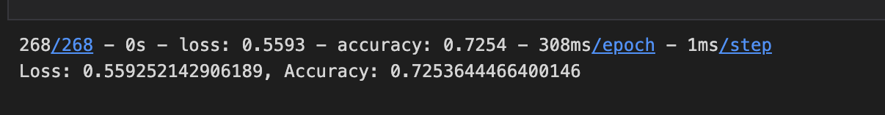
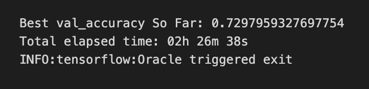

# Charity Analysis with Neural Network

## Project Overview

### Purpose

The purpose of this project is to build a **Neural Network** binary classifier model that can predict the success of charities to a 75% accuracy.

### Data

**[charity_data.csv](./resources/charity_data.csv)**

## Results

### Data Preprocessing

- The variable being considered as the **target** for this model:
  - `IS_SUCCESSFUL` column

- The variables being consider as **features** for this model:
  - `APPLICATION_TYPE` column
  - `AFFILIATION` column
  - `CLASSIFICATION` column
  - `USE_CASE` column
  - `ORGANIZATION` column
  - `STATUS` column
  - `INCOME_AMT` column
  - `SPECIAL_CONSIDERATIONS` column
  - `ASK_AMT` column

- The variables which were neither target nor features and were **removed** from this dataset:
  - `EIN`
  - `NAME`

### Compiling and Training

The model had the following:

1. Input layer of **86 Neurons**, **ReLU** activation. I had recent success with ReLU as a starting activation, so I used it here.
2. Hidden layer of **43 Neurons**, **Tanh** activation. I used Tanh to give some shape change to the model.
4. Output layer of **1 Neuron**, **Sigmoid** activation. I used Sigmoid as the output to be able to better process the data into a final binary prediction.

### Evaluating the Model

The model was not able to reach the goal of 75% accuracy with the above mentioned model. I was able to get to an accuracy of **72.54%** using the first model:

I tried changing activation methods, number of neurons, number of layers, and changing the scaling methods from Standard Scaler to Min Max Scaler, but the optimizations didn't improve anything when I manually changed parameters.

### Automating the Optimization

I decided to try using the **Hyperband** automated optimizing method from the `keras_tuner` library. I used this method in 3 different ways. With the most successful one, I had also reduced the amount of bucketing I was doing to the data initially, just in case that the original bucket method was removing important data.

This model had the following:
1. Input layer of **91 Neurons**, **ReLU** activation.
2. Hidden layer of **21 Neurons**, **ReLU** activation.
2. Hidden layer of **26 Neurons**, **ReLU** activation.
2. Hidden layer of **6 Neurons**, **ReLU** activation.
2. Hidden layer of **16 Neurons**, **ReLU** activation.
4. Output layer of **1 Neuron**, **Sigmoid** activation.

The results of that was a model with a **72.98%** accuracy:

## Summary

Despite not getting to 75% accuracy, this model is still something I could trust with a 72.98% accuracy. Refining the model from the original 72.53% to the 72.98% was a great learning experience.

Ways that the model could be improved:

- Collect more data: The more data you have, the better your model can learn and generalize. You could collect more data on the charities and try to retrain the model.
- Try different neural network structures: You could try different neural network structures, such as increasing or decreasing the number of hidden layers or neurons, or using a different combination of activation functions.
- Try different training parameters: You could try different training parameters, such as changing the learning rate, the optimizer, or the batch size.
- Try different models: You could try different machine learning models, such as decision trees, random forests, or support vector machines. These models might be better suited for the type of data you have.

Overall, it's important to experiment with different approaches to see what outcomes are possible.

